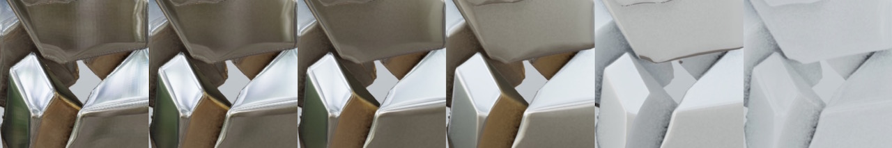
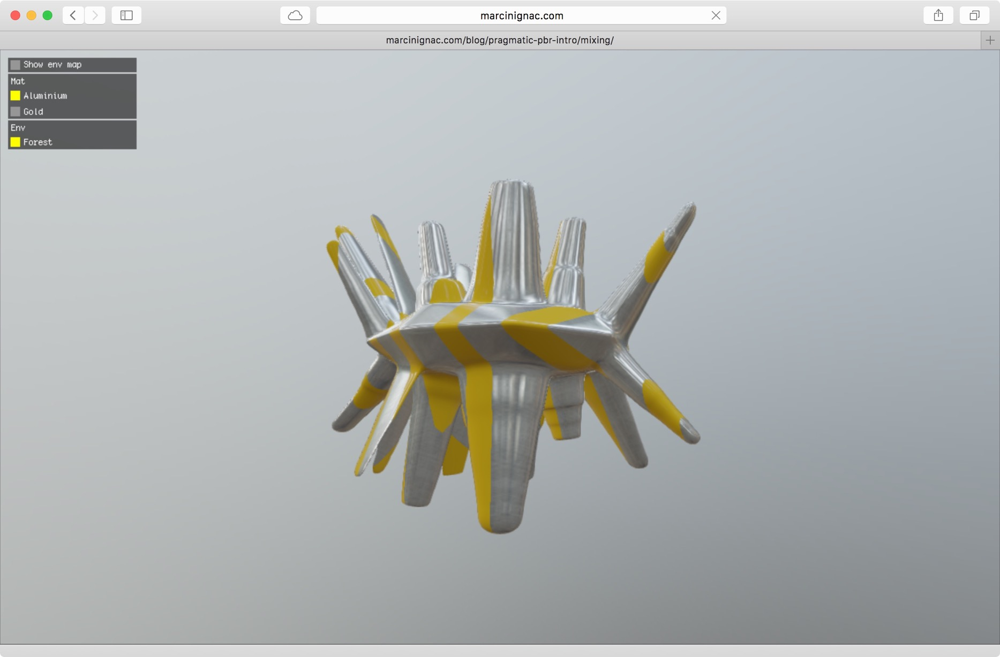
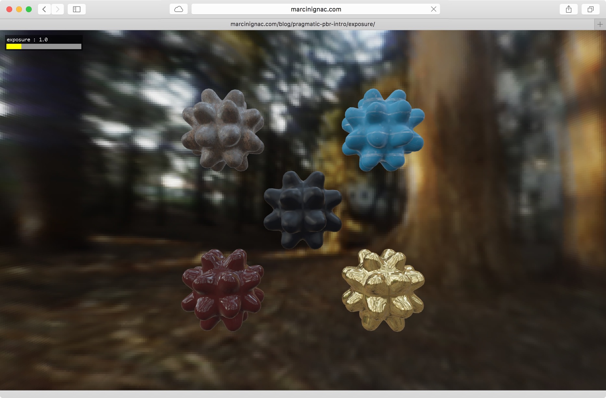

# Pragmatic PBR - Intro

This blog post is a part of series about implementing PBR in WebGL from scratch:

1. **[Intro](http://marcinignac.com/blog/pragmatic-pbr-intro)**
2. [Setup & Gamma](http://marcinignac.com/blog/pragmatic-pbr-setup-and-gamma)
2. [HDR](http://marcinignac.com/blog/pragmatic-pbr-hdr)

### What is Physically Based Rendering (PBR)?

PBR is a set of techniques aiming at improving realism of rendered graphics by
using more physically correct formulas on how surfaces interact with light. Sometimes, especially in the realtime context it's called Physically Based Shading - PBS.


Compared to the old-school Ambient + Lambert Diffuse + Specular Blinn-Phong that
you might know from OpenGL 1.0/2.0 era and first WebGL 1.0 engines, PBR brings *a promise* of the following benefits:

**Unified shader** being able to express wide range of materials from ceramics, wood and iron to sci-fi aluminum, chrome and plastic.


**Predicable look** under different lighting conditions.


### Parameters

We will cover this in more details in the future but in PBR we divide our materials into two main types:

**Dielectrics / insulators** (from plastic to rubber) - medium to very low reflectivity, base color due to reflected diffuse light


**Metals / conductors** (from silver to brushed aluminium) - highly reflective, no base color as they absorb the light, optional tint (e.g. gold)



### PBR frame breakdown

Albedo, direct light diffuse, fresnel, diffuse reflection, specular reflection, final composition. More on this in the future as not everything here is 100% correct (e.g. I'm not completely sure about Fresnel)


## Demos

WARNING:

- these demos are big, between 10-20MB = fidlots of staring at a black screen, please be patient and watch your JavaScript dev console logs
- should work on any major browser Chrome, Safari, Firefox both on Windows and on OSX
- it doesn't work on FF/OSX due to [these](https://bugzilla.mozilla.org/show_bug.cgi?id=965848) [bugs](https://bugzilla.mozilla.org/show_bug.cgi?id=1111689)
- currently doesn't work on iOS as I didn't support texture HALF_FLOAT
- it hasn't been tested on Android

[**Materials**](http://marcinignac.com/blog/pragmatic-pbr-intro/materials/) (Click for the realtime version)

[](http://marcinignac.com/blog/pragmatic-pbr-intro/materials/)

[**Material mixing**](http://marcinignac.com/blog/pragmatic-pbr-intro/mixing/) (Click for the realtime version)

[](http://marcinignac.com/blog/pragmatic-pbr-intro/mixing/)

[**Exposure**](http://marcinignac.com/blog/pragmatic-pbr-intro/exposure/) (Click for the realtime version)

[](http://marcinignac.com/blog/pragmatic-pbr-intro/exposure/)


## Can I haz code?

NOPE. Sorry. Please continue reading to find out why.

## Purpose of these posts

In the last 1.5 years I've implemented 2-3 versions of PBR in the last year
with a varying [success](http://variable.io/fibers/) due to complexity and
amount of supporting engine code they require. They are also custom, per-project built tools
and therefore often no publishable online. And the code is a mess.

Learning about all that stuff is a pain. Most talks assume you just finished
writing your own renderer and know all the math or you are just upgrading your
engine with some new tricks and techniques. I haven't really found a A-Z
description of how to put all these pieces to together in code.

So the idea is that through the series of blog posts I reimplement PBR with a better
understanding of the math involved and document the process.

## Goals:

- learn the math properly
- fix the mess above
- share runnable code implementing these ideas
- spread the NPM love and publish reusable parts as node modules
- write clean documented code with embedded math formulas so we know where are we

```
//this is shader code
//Normal Distribution Function: GGX
//                    a^2
//D(h) = --------------------------------
//       PI * ((n.h)^2 * (a^2 - 1) + 1)^2
float aSqr = a * a;
float Ddenom = dotNH * dotNH * (aSqr - 1.0) + 1.0;
float Dh = aSqr / ( PI * Ddenom * Ddenom);
```

## Topics

What's complexity you would ask? Let's try to list things that we should
understand or at least know about and probably implement at some point:

- pbr workflows
    - specular vs metallic
    - albedo, glossines, roughes, specular, ao, cavity
    - metals and dielectrics
    - lighting models
- image base lighting
    - irradiance environment map (IEM)
    - prefiltered mipmaped radiance environment map (PMREM)
    - spherical harmonics
- uber shaders (tried all three approaches)
    - string concatenation
    - ifdef code switches
    - glslify modules
- texture loading
    - hdr
    - dds
    - cubemap atlasses
    - octagonal env maps
- color
    - gamma correction
    - linear space
    - hdr
    - tonemapping
- lighting
    - brdfs
    - energy conservation
    - fresnel
    - how IBL fits here
    - area lights
- bump mapping
    - tri planar texturing for generative shapes (used in the demos)

## What's next

In the next blog post I'll setup the code base, cover some basics like HDR, tonemapping and gamma to prepare us for Image Based Lighting.

## Other material

In the meantime you might want to check out some other material covering the topic:

Blogs

- PBR in JMonkeyEngine: [I - PBR for Artists](http://jmonkeyengine.org/299803/physically-based-rendering-part-one/), [II - PBR for Developers](http://jmonkeyengine.org/300495/physically-based-rendering-part-two/), [III - IBL](http://jmonkeyengine.org/301308/physically-based-rendering-part-3/)
- Marmoset: [Basic Theory of Physically-Based Rendering](https://www.marmoset.co/toolbag/learn/pbr-theory), [Physically Based Rendering, And You Can Too!](http://www.marmoset.co/toolbag/learn/pbr-practice), [PBR Texture Conversion](http://www.marmoset.co/toolbag/learn/pbr-conversion)

Presentations

- [Unity Physically Based Shading](http://aras-p.info/texts/files/201403-GDC_UnityPhysicallyBasedShading_notes.pdf)
- [Real Shading in Unreal Engine 4](http://blog.selfshadow.com/publications/s2013-shading-course/karis/s2013_pbs_epic_slides.pdf) + [Notes](http://blog.selfshadow.com/publications/s2013-shading-course/karis/s2013_pbs_epic_notes_v2.pdf)
- [Crafting a Next-Gen Material Pipeline for The Order: 1886](http://blog.selfshadow.com/publications/s2013-shading-course/rad/s2013_pbs_rad_slides.pdf) + [Notes](http://blog.selfshadow.com/publications/s2013-shading-course/rad/s2013_pbs_rad_notes.pdf)
- [SIGGRAPH 2013 Course Physically Based Shading in Theory and Practice](http://blog.selfshadow.com/publications/s2013-shading-course/#course_content)

PBR Books

- [Physically Based Rendering: From Theory to Implementation](http://www.pbrt.org)

Open source engines implementing PBR

- [playcanvas](https://github.com/playcanvas/engine)
- [jmonkeyengine](https://github.com/jMonkeyEngine/jmonkeyengine)

## Credits

- 2D material textures come from [http://gametextures.com](http://gametextures.com) [ [License](http://gametextures.com/blog/2011/07/07/non-commercial-license/) ]
- Environmental cubemaps come from [Mr F](https://twitter.com/guycalledfrank) filtered using [Modified AMD CubemapGen](https://seblagarde.wordpress.com/2012/06/10/amd-cubemapgen-for-physically-based-rendering/) based on Paul Debevec [IBL Probes](http://www.pauldebevec.com/Probes/)
