## Pragmatic PBR - Setup & Gamma

This blog post is a part of series about implementing PBR in WebGL from scratch:

1. [Intro](http://marcinignac.com/blog/pragmatic-pbr-intro)
2. [Setup & Gamma](http://marcinignac.com/blog/pragmatic-pbr-setup-and-gamma)

## Setup

Before we start let's make sure we can get the code up and running properly. I will assume you have working knowledge of JavaScript and GLSL.

### NodeJS

Hopefully you also used `nodejs` and `npm` (node package manager) before as we will use it quite a lot here. If you don't have `nodejs` you should install it now from [https://nodejs.org](https://nodejs.org) (this will also install `npm` for you)

### Browser & OS

I'm testing all the code in Safari 8.0.7 (as of time of writing this blog post) on OSX 10.10.4. Most of the code should work in any other major browser (Chrome 43+, Firefox 39+, Safari 8+) and operating system. There are some extensions missing in Safari and Firefox that we will use for specific tasks but I'll always give a warning about it in the related section of each post. Making it work on mobile is not a top priority at the moment but I'll test it as much as I can on the iOS. I don't have an Android device to test with unfortunately (bug fixes and pull requests are welcome!).

### Getting the code

All the code and text for these tutorials lives at [https://github.com/vorg/pragmatic-pbr](https://github.com/vorg/pragmatic-pbr). You can get it by downloading [master.zip](https://github.com/vorg/pragmatic-pbr/archive/master.zip) or via `git`.

```bash
git clone https://github.com/vorg/pragmatic-pbr.git
```

Next let's enter the repo folder and install the dependencies.

```bash
cd pragmatic-pbr
npm install
```

### Running the code

To make sure everything works run the following command while in `pragmatic-pbr` directory.

```bash
beefy 201-init/main.js --open --live -- -i plask -g glslify-promise/transform
```

This should open your browser at [http://127.0.0.1:9966](http://127.0.0.1:9966) and display a rectangle that changes colors (click to see live version)

[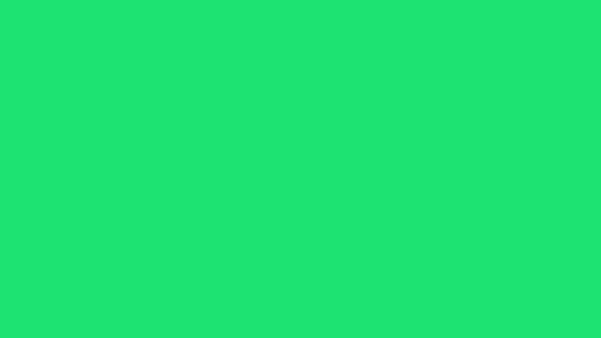](http://marcinignac.com/blog/pragmatic-pbr-setup-and-gamma/201-init/)

What is beefy? [Beefy](https://www.npmjs.com/package/beefy) is a local server that boundles our code and required node modules into one JS file using [browserify](http://browserify.org) that can be loaded by the browser. It also watches for changes (when run with `--live` flag) and will reload the page when you edit and save the JS file. Running a local server also solves a number of issues with AJAX requests and local file access policies in the browsers. In the `-- -i plask` part we have `browserify` flags where we ignore `plask` module and run our source code through `glslify` transform that will inline all the GLSL shaders. [Plask](http://plask.org) is a multimedia programming environment for OSX built on top of NodeJS and implementing WebGL v1.0+ spec. You can use it to run WebGL apps on OSX without the browser. I use it for development but we won't be using it in this tutorial.

### Deploying the code

If you build on top of this tutorial and would like to have standalone (bundled) version that doesn't need beefy to run you can run the `browserify` yourself:

```bash
browserify 201-init/main.js -i plask -g glslify-promise/transform -o 201-init/main.web.js
```

You will then need to add following `201-init/index.html` file:

```html
<!DOCTYPE html>
<html lang="en">
<head>
    <meta charset="UTF-8">
    <title>Pragmatic PBR</title>
    <script src="main.web.js"></script>
</head>
<body>
</body>
</html>
```

### Dependencies

##### Pex

When I said 'from scratch' I was relating to modern rendering and PBR specific techniques. We don't want to reinvent the wheel and implement things like texture loading and creating WebGL context. For these boring parts we will be using `pex`. PEX is a WebGL library standing somewhere between [stack.gl](http://stack.gl) micromodules and monolithic [three.js](http://threejs.org) (although they started upgrading to a [more modular](https://github.com/mrdoob/three.js/issues/6280#issuecomment-85709471) code recently). This project is using next version of pex that's currently in development. There are numerous differences between this version and [the one currently on npm](http://vorg.github.io/pex/):

- Moving away from proprietary Vec3, Mat4 etc in favor of arrays [x, y, z] etc. This allows better compatibility with existing npm modules and avoids marshalling (converting arrays to Vec3 etc) and simplifies serialization.
- Proper WebGL context abstraction with 1:1 wrappers for core WebGL objects (Texture, Framebuffer, VertexArray etc), state stack and extensions loading.
- Even bigger modularization (pex-glu -> pex-context, pex-cam, pex-geom -> pex-math, pex-geom, geom-subdivide). We are still in minimodules realm (multiple classes per module) with per class imports (pex-sys/Window) as we believe in API consistency. At the same time micromodules (single function, single class) are used whenever possible (e.g. is-browser, glsl-inverse)
- [glslify](https://github.com/stackgl/glslify) for modular shader development
- New main contributor [Henryk Wollik](https://github.com/automat) and therefore many cool ideas from [foam-gl](https://github.com/automat/foam-gl)

As this version of pex is not on `npm` yet (the beauty of always alpha software) so we will require it straight from the GitHub. This is not a problem for `npm`. All we need to do is put the username (variablestudio is an org name for my studio [variable.io](http://variable.io) before the package name in [package.json](https://github.com/vorg/pragmatic-pbr/blob/master/package.json#L19) where all the dependencies are specified and installed when calling `npm install`.

```json
"dependencies": {
    "pex-cam": "variablestudio/pex-cam",
    "pex-context": "variablestudio/pex-context",
    "pex-io": "variablestudio/pex-io",
    "pex-math": "variablestudio/pex-math",
    "pex-sys": "variablestudio/pex-sys"
}
```

##### 3rd party dependencies

We will use modules available on `npm` whenever possible for both JavaScript (e.g [re-map](https://www.npmjs.com/package/re-map)) and GLSL via `glslify` (e.g. [glsl-inverse]((https://www.npmjs.com/package/glsl-inverse)))

##### Local dependencies

Recently I've started a new practice of extracting reusable code into micromodules as soon as possible in the project to prevent them from capturing too much context and becoming part of the spaghetti that every projects ends up in eventually (especially with last minute fixes). I put them in the `local_modules` folder and require as usual:

```javascript
var createCube   = require('../local_modules/primitive-cube');
```

Most of them will eventually end up on `npm` but I want to make sure the API is tested in practice so we avoid v0.0.0 zombie modules that are abandoned after the first push (`npm` is full of them unfortunately).

## 201-init

This is just a quick test to make sure our setup works. The basic structure of a pex program is as follows (we will go into more details in the next section):

```javascript
//imports
var Window = require('pex-sys/Window');

//Open window
Window.create({
    settings: {
        //initial window properties
    },
    resources: {
        //optional resource files to load before init
    },
    init: function() {
        //this code is executed after WebGL context creation
    },
    draw: function() {
        //this code is executed every frame
    }
})
```

So to make a window with background color changing every frame we would write:

```javascript
var Window = require('pex-sys/Window');

var frame = 0;

Window.create({
    settings: {
        width: 1024,
        height: 576
    },
    //skipping resources
    //skipping init
    draw: function() {
        var ctx = this.getContext();
        frame++;
        var r = 0.5 + 0.5 * Math.sin(frame/10);
        var g = 0.5 + 0.5 * Math.cos(frame/10 + Math.PI/2);
        var b = 0.5 + 0.5 * Math.sin(frame/10 + Math.PI/4);
        ctx.setClearColor(r, g, b, 1.0);
        ctx.clear(ctx.COLOR_BIT);
    }
})
```

## 202-lambert-diffuse

[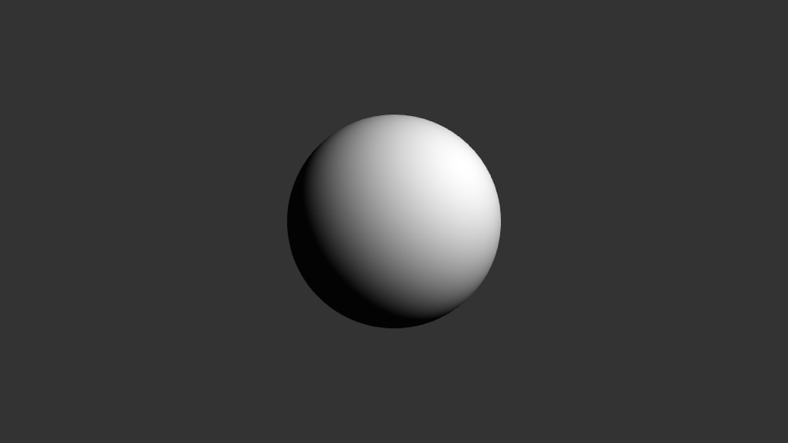](http://marcinignac.com/blog/pragmatic-pbr-setup-and-gamma/202-lambert-diffuse/)

Let's start with a simple scene containing one sphere and a single point light. We will make a number of assumptions: the surface of the sphere is white, the light color is white and there is no light attenuation (light loosing intensity with distance) and the light's position is static (no animation) and located at `[10,10,10]` (top right, in front of the sphere).

### Diffuse Lighting

In order to calculate the appearance of a surface under these lighting conditions we need a lighting (shading) model. One of the simplest and most commonly used shading models is [Lambertian reflectance](https://en.wikipedia.org/wiki/Lambertian_reflectance) also known as *Lambert diffuse* or just *Lambert*. It models a [diffuse reflection](https://en.wikipedia.org/wiki/Diffuse_reflection) (light reflecting into multiple directions -> blurry reflection) for matte / rough objects. It doesn't handle [specular reflection](https://en.wikipedia.org/wiki/Specular_reflection) (light reflecting into single direction causing -> sharp, mirror / highlight like) but we don't need that yet. Lambert diffuse obeys [Lambert's cosine law](https://en.wikipedia.org/wiki/Lambert%27s_cosine_law) stating that light intensity observed on the surface is proportional to the cosine of the angle between direction towards the light and [the surface normal](https://en.wikipedia.org/wiki/Normal_(geometry)). 

If both direction towards the light and normal point in the same direction the angle will be `0` and `cos(0) = 1` therefore intensity will be the strongest. At `45' deg` we have are losing 30% of the intensity `cos(PI/4) = 0.707`, dropping to zero at `90' deg` as `cos(PI/2) = 0`.

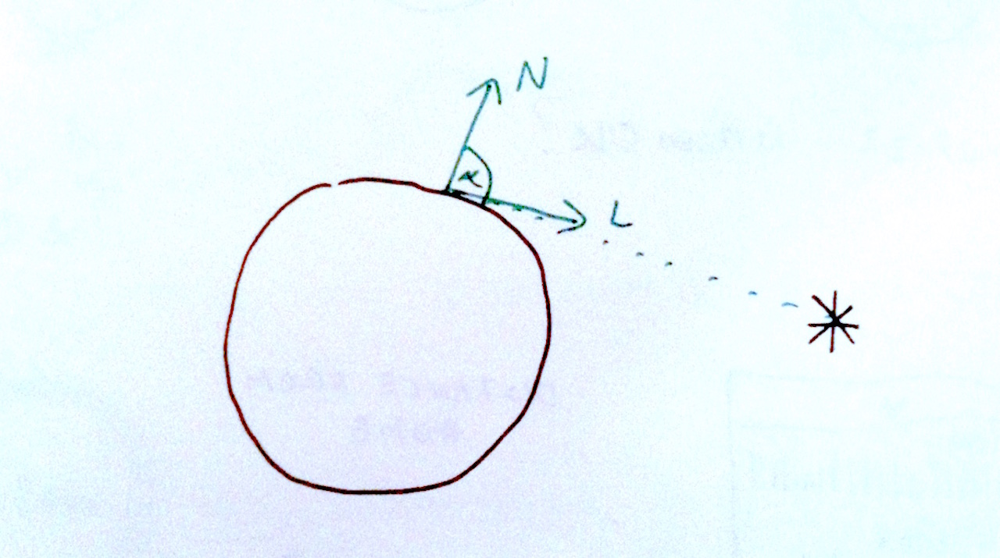

We can measure the angle between two vectors using a [dot products](https://en.wikipedia.org/wiki/Dot_product) `N·L`

```javascript
//Id - diffuse intensity
Id = N·L
```

One way to calculate a dot product is to multiply lengths of the two vectors and cosine of the angle between them.

```javascript
//|N| - length of the surface normal
//|L| - length of the direction towards the light
Id = N·L = |N|*|L|*cos(a)
```

If both the vectors are normalized (their length is 1) then our formula simplifies even more.

```javascript
//assuming |N| = 1 and |L| = 1
Id = N·L = |N|*|L|*cos(a) = cos(a)
```

In practice we will always assume that input vectors `N` and `L` are normalized and use `dot` function that is natively supported in GLSL shader language.

```glsl
I = dot(N, L)
```

Here is the implementation from [glsl-diffuse-lambert](https://www.npmjs.com/package/glsl-diffuse-lambert) module that we will later use.

*glsl-diffuse-lambert/index.js:*

```glsl
float lambertDiffuse(vec3 lightDirection, vec3 surfaceNormal) {
  return max(0.0, dot(lightDirection, surfaceNormal));
}
```

The `max(0.0, dot(L, N)` is to prevent going below zero for angles > 90'deg that would cause invalid colors on the output (we can't go blacker than black `[0,0,0]`).

### Transformations

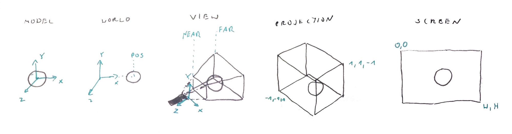

```javascript
Model Space        //vertex position
     ↓
Model Matrix       //model position, rotation, scale
     ↓
World Space        //position in the scene
     ↓
View Matrix        //camera position and direction
     ↓
View space         //eye space, camera space
     ↓
Projection Matrix  //perspective projection, orthographic projection
     ↓
Projection Space   //projection/ clipping space, normalized device coordinates
     ↓
  Viewport         //part of the window that we render to
     ↓  
Screen Space       //window position
```


You can read more about the math behind these matrices at [Coding Labs: World, View and Projection Transformation Matrices](http://www.codinglabs.net/article_world_view_projection_matrix.aspx).


Fire the following command to open this example in the browser:

```
beefy 202-lambert-diffuse/main.js --open --live -- -i plask -g glslify-promise/transform
```

*202-lambert-diffuse/main.js*:

```javascript
//Import all the dependencies
var Window       = require('pex-sys/Window');
var Mat4         = require('pex-math/Mat4');
var Vec3         = require('pex-math/Vec3');
var glslify      = require('glslify-promise');
var createSphere = require('primitive-sphere');

//Create window - in the borwser this will:
//- create new Canvas element with width/height specified in the `settings`
//- append it to <body>
//- get WebGL context
//- add event listeners for mouse and keyboard events
//- load all requested resources
//- call init()
//- keep calling draw() using Window.requestAnimationFrame()
Window.create({
    //Window / canvas properties
    settings: {
        width: 1024,
        height: 576
    },
    //Files (text, json, glsl vis glslify, images) to load before init
    resources: {
        vert: { glsl: glslify(__dirname + '/Material.vert') },
        frag: { glsl: glslify(__dirname + '/Material.frag') }
    },
    //Init is called after creating WebGL context and successfuly loading all the resources
    init: function() {
        //pex-context/Context object - the pex's WebGL context wrapper
        var ctx = this.getContext();

        //Model transformation matrix
        //An Array with 16 numbers initialized to an identity matrix
        this.model = Mat4.create();

        //Camera projection matrix
        this.projection = Mat4.perspective(
            Mat4.create(),             //new matrix
            45,                        //45' deg fov
            this.getAspectRatio(),     //window aspect ratio width/height
            0.001,                     //near clipping plane
            10.0                       //far clipping plane
        );

        //Camera view matrix
        this.view = Mat4.create();
        //[0,1,5] - eye position
        //[0,0,0] - target position
        //[0,1,0] - camera up vector
        Mat4.lookAt(this.view, [0, 1, 5], [0, 0, 0], [0, 1, 0]);

        //The Context keeps a separate matrix stack for the projection,
        //view and model matrix. Additionaly it will compute normal matrix
        //and inverse view matrix whenever view matrix changes
        ctx.setProjectionMatrix(this.projection);
        ctx.setViewMatrix(this.view);
        ctx.setModelMatrix(this.model);

        //Get reference to all loaded resources
        var res = this.getResources();

        //Each resource of type `glsl` will be replace by string with the loaded GLSL code
        //We can use that code to create a WebGL Program object
        this.program = ctx.createProgram(res.vert, res.frag);

        //Create sphere geometry - an object with positions, normals and cells/faces
        var g = createSphere();

        //Definie mesh attribute layout
        //ATTRIB_POSITION and ATTRIB_NORMAL are slot numbers
        //matching attributes in the shader aPosition and aNormal
        var attributes = [
            { data: g.positions, location: ctx.ATTRIB_POSITION },
            { data: g.normals, location: ctx.ATTRIB_NORMAL }
        ];

        //Define vertices data
        var indices = { data: g.cells };

        //Create mesh to be rendered as a list of TRIANGLEs
        this.mesh = ctx.createMesh(attributes, indices, ctx.TRIANGLES);
    },
    //This function is called as close as possible to 60fps via requestAnimationFrame
    draw: function() {
        var ctx = this.getContext();

        //Set gl clear color to dark grey
        ctx.setClearColor(0.2, 0.2, 0.2, 1);

        //Clear the color and depth buffers
        ctx.clear(ctx.COLOR_BIT | ctx.DEPTH_BIT);

        //Enable depth testing
        ctx.setDepthTest(true);

        //Activate our GLSL program
        ctx.bindProgram(this.program);

        //Set the light's position uniform
        //There is no need to set matrix uniforms like uProjectionMatrix as
        //these are handled by the context. List of all handled uniforms is
        //in pex-context/ProgramUniform.js
        this.program.setUniform('uLightPos', [10, 10, 10])

        //Activate the sphere mesh
        ctx.bindMesh(this.mesh);

        //Draw the currently active mesh (sphere in this example)
        ctx.drawMesh();
    }
})
```

*202-lambert-diffuse/Material.vert*:

```glsl
attribute vec4 aPosition;
attribute vec3 aNormal;

uniform mat4 uProjectionMatrix;
uniform mat4 uViewMatrix;
uniform mat4 uModelMatrix;
uniform mat3 uNormalMatrix;

uniform vec3 uLightPos;

varying vec3 ecNormal;
varying vec3 ecLight;
varying vec3 ecPosition;

void main() {
    vec4 pos = uViewMatrix * uModelMatrix * aPosition;
    ecPosition = pos.xyz;
    gl_Position = uProjectionMatrix * pos;
    ecLight = vec3(uViewMatrix * uModelMatrix * vec4(uLightPos, 1.0));
    ecNormal = uNormalMatrix * aNormal;
}
```

*202-lambert-diffuse/Material.frag*:

```glsl
#pragma glslify: lambert   = require(glsl-diffuse-lambert)

varying vec3 ecNormal;
varying vec3 ecLight;
varying vec3 ecPosition;

void main() {
    vec3 N = normalize(ecNormal);
    vec3 L = normalize(ecLight - ecPosition);
    vec3 V = normalize(-ecPosition);
    float diffuse = lambert(L, N);

    //albedo
    vec4 baseColor = vec4(1.0);

    vec4 finalColor = vec4(baseColor.rgb * diffuse, 1.0);
    gl_FragColor = finalColor;
}
```


## 203-gamma

PBR looks good because it's trying to avoid errors and approximations that accumulate across different rendering stages (color sampling, lighting / shading, blending etc). One of these assumptions is that that half the value 0.5 equals half the brightness. Unfortunately this is now how things work. Most screen we are using nowadays follow so called gamma curve that maps the input value to the brightness of a pixel.

Source: [Wikipedia: Gamma_correction](https://en.wikipedia.org/wiki/Gamma_correction)
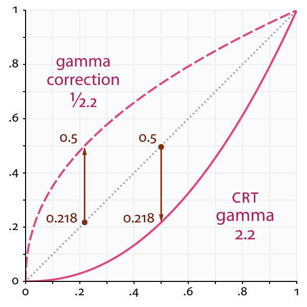


[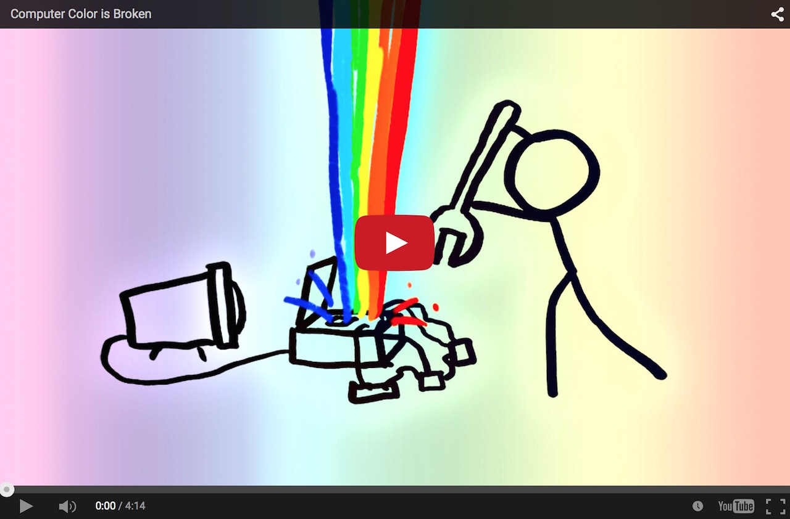](https://www.youtube.com/watch?v=LKnqECcg6Gw)

Other links worth checking out:

- [GPU Gems 3: The Importance of Being Linear (2008)](http://http.developer.nvidia.com/GPUGems3/gpugems3_ch24.html)
- [Filmic Games: Linear-Space Lighting (i.e. Gamma) (2010)](http://filmicgames.com/archives/299)
- [Coding Labs: Gamma and Linear Spaces](http://www.codinglabs.net/article_gamma_vs_linear.aspx)
- [Gamasutra: Gamma-Correct Lighting (2010)](http://www.gamasutra.com/blogs/DavidRosen/20100204/4322/GammaCorrect_Lighting.php)

http://renderwonk.com/blog/index.php/archive/adventures-with-gamma-correct-rendering/ ??
http://d.hatena.ne.jp/hanecci/20120108 ??

[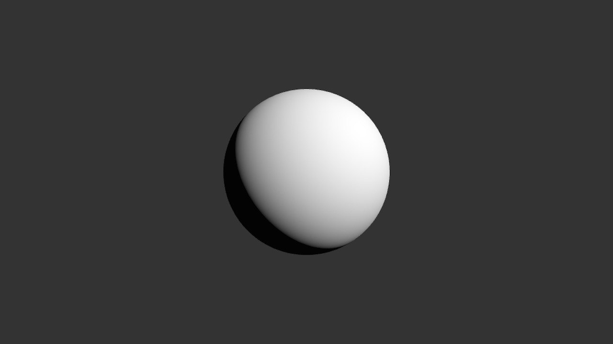](http://marcinignac.com/blog/pragmatic-pbr-setup-and-gamma/203-gamma/)


*203-gamma/Material.frag*:

```glsl
#pragma glslify: lambert   = require(glsl-diffuse-lambert)
#pragma glslify: toLinear = require(glsl-gamma/in)
#pragma glslify: toGamma  = require(glsl-gamma/out)

varying vec3 ecNormal;
varying vec3 ecLight;
varying vec3 ecPosition;

float PI = 3.14159265;

void main() {
    vec3 N = normalize(ecNormal);
    vec3 L = normalize(ecLight - ecPosition);
    vec3 V = normalize(-ecPosition);
    //float diffuse = lambert(L, N) / PI;
    float diffuse = lambert(L, N);

    //albedo
    vec4 baseColor = toLinear(vec4(1.0));

    vec4 finalColor = vec4(baseColor.rgb * diffuse, 1.0);
    gl_FragColor = toGamma(finalColor);
}
```

*glsl-gamma/in*:

```glsl
const float gamma = 2.2;

vec3 toLinear(vec3 v) {
  return pow(v, vec3(gamma));
}

vec4 toLinear(vec4 v) {
  return vec4(toLinear(v.rgb), v.a);
}
```

*glsl-gamma/out*:

```glsl
const float gamma = 2.2;

vec3 toGamma(vec3 v) {
  return pow(v, vec3(1.0 / gamma));
}

vec4 toGamma(vec4 v) {
  return vec4(toGamma(v.rgb), v.a);
}
```

This looks pretty much like an object i've seen somewhere before... as Vincent Scheib is pointing on his [Beautiful Pixels blog](http://beautifulpixels.blogspot.co.uk/2009/10/gamma-correct-lighting-on-moon.html).

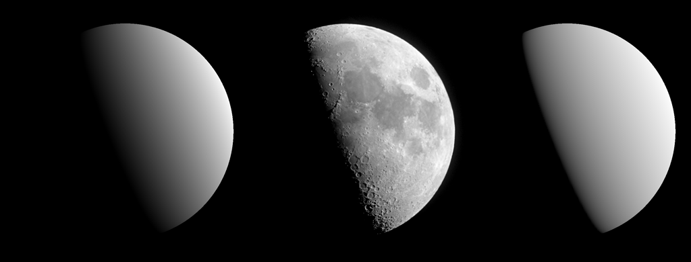

## 204-gamma-color

I made a spearate example with two lights

[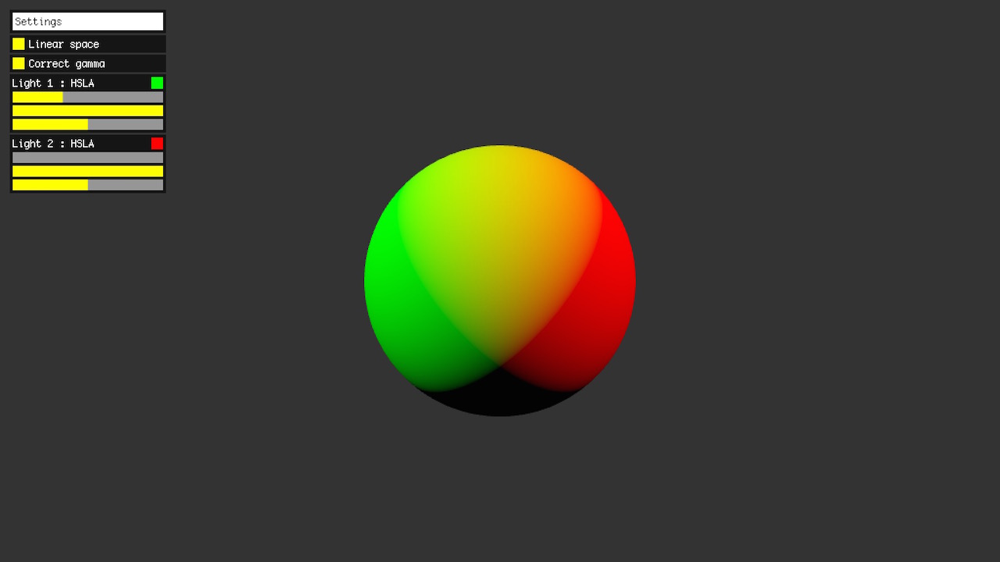](http://marcinignac.com/blog/pragmatic-pbr-setup-and-gamma/204-gamma-color/)

Try turning conversion to linear and gamma space to see the difference. Do you see that ugly brown on the left (uncorrected) side?


## 205-gamma-texture

[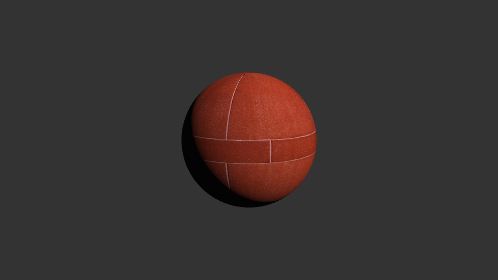](http://marcinignac.com/blog/pragmatic-pbr-setup-and-gamma/205-gamma-texture/)

The brick texture comes from [Pixar One Twenty Eight](https://community.renderman.pixar.com/article/114/library-pixar-one-twenty-eight.html) - a collection of classic textures from Pixar. Only some of them are suitable for physically based rendering as many include lighting / shadows baked together with color.

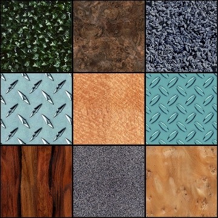


## 206-gamma-ext-srgb

[EXT_sRGB Extension](https://www.khronos.org/registry/webgl/extensions/EXT_sRGB/)

```javascript
gl.getExtension('EXT_sRGB')
```

```
//sample color as usual, the RGB values will be converted to linear space for you
vec4 baseColor = texture2D(uAlbedoTex, vTexCoord0 * vec2(3.0, 2.0));
vec4 finalColor = vec4(baseColor.rgb * diffuse, 1.0);

//we still need to bring it back to the gamma color space as we don't have sRGB aware render buffer here
gl_FragColor = toGamma(finalColor);
```

According to [WebGL Report](http://webglreport.com/?v=1) supported in:

- [x] Chrome 43+ on OSX
- [x] Firefox 39+ on OSX
- [x] Webkit Nighly r186719 on OSX
- [ ] Safari 8.0.7 on OSX

Additionaly

- [ ] Plask v3 (due to images being uploaded to the GPU always as RGB)
- [x] EXT_sRGB will be in core WebGL 2.0

If you don't have EXT_sRGB enabled or supported you will get brighter image than expected due to

[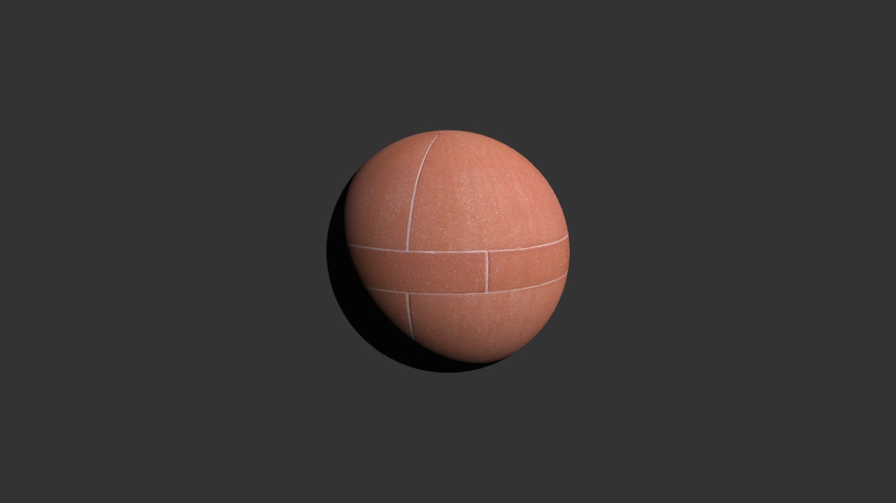](http://marcinignac.com/blog/pragmatic-pbr-setup-and-gamma/206-gamma-ext-srgb/)


## TODO:

- [ ] switch from point light to directional light
