# Pragmatic PBR - HDR

This blog post is a part of series about implementing PBR in WebGL from scratch:

1. [Intro](http://marcinignac.com/blog/pragmatic-pbr-intro)
2. [Setup & Gamma](http://marcinignac.com/blog/pragmatic-pbr-setup-and-gamma)
2. **[HDR](http://marcinignac.com/blog/pragmatic-pbr-hdr)**

## What is HDR?

Traditional images (e.g. your average JPG) represent RGB color values as numbers from 0..255 (or 0..1 in GLSL) for each component R, G, B. This is not how light behaves in real life e.g. sunshine is 1000s times brighter than a lightbulb. In oder to fit the lighting information (pixel brightness / color) into that LDR (Low Dynamic Range) space some of the information has to be lost. That's clearly visible when you take a photo against the sun and suddenly everything else is black or the opposite you focus on your face but the whole background is overexposed and white.


HDR - High Dynamic Range images on the other side allow you to store image data with values above 255. That allows you to capture both the dark and bright areas at the same time. We can then adjust the exposure of the photo in realtime to focus on the desired range or apply process called tonemapping to avoid over or under exposing the image.

## 301-load-cubemap ([code](https://github.com/vorg/pragmatic-pbr/blob/master/301-load-cubemap/main.js))

One of the best source of HDR images are so called environment maps. They fully capture the environment around you not only at 360' but also above and below.

We can represent that that environment as a cube surrounding the viewer hence the name of such textures in WebGL : *CubeMaps*. Below you can see cross representation of a CubeMap with 6 sides facing the axes as follows:
<span style="color:red">+X</span>,
<span style="color:red">-X</span>,
<span style="color:green">+Y</span>,
<span style="color:green">-Y</span>,
<span style="color:blue">+Z</span>,
<span style="color:blue">-Z</span>.

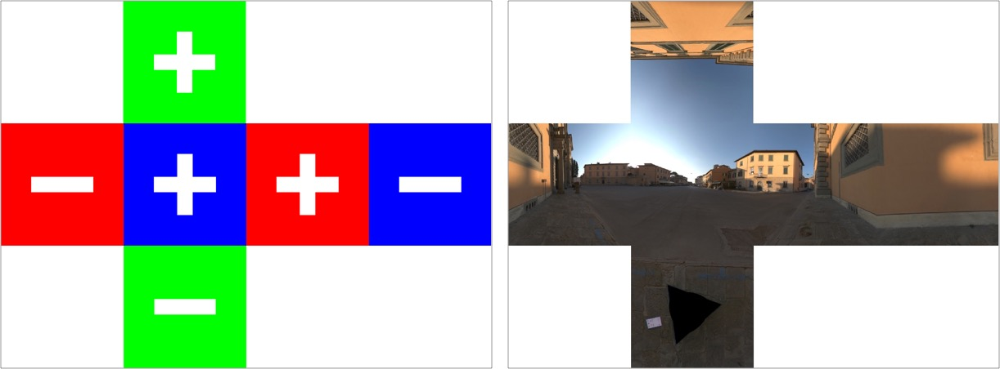

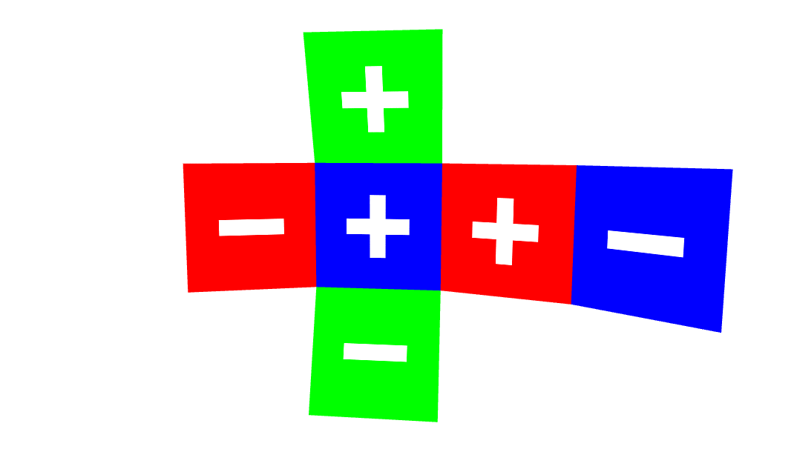

I would be a bit cumbersome to upload such a texture to the GPU so a better way is to load all the faces separately.

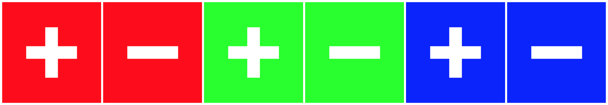
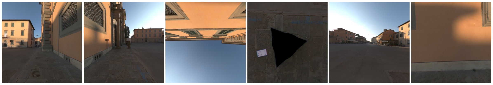

#### Cubemap Orientation

There is only one problem. If you look carefully you will notice that <span style="color:blue">+Z</span> side of the cube is facing away from us. In WebGL the convention is that <span style="color:blue">+Z</span> should face towards the viewer. We call that orientation right handed because if you count on your right hand 1,2,3 for X,Y,Z starting from your thumb you your fingers will form an orthogonal basis with the Z axis pointing towards you.


Becaues cubemaps spec comes from the time when RenderMap ruled the world and it's using Left-Handed Coordinate system so do the cubemaps. That means to we will need to flip the X axis in our shader whenever we sample from a CubeMap texture. Additionally you will need to point your camera towards <span style="color:blue">+Z</span> instead of the usual <span style="color:blue">-Z</span> in order to start at expected direction. Otherwise you might end up looking at the wall like in case of the Pisa texture we are using.

The Pisa texture comes from [High-Resolution Light Probe Image Gallery
](http://gl.ict.usc.edu/Data/HighResProbes/) but it doesn't specify where exactly it was taken. I've been struggling so much with "should I flip Z or X?" that I decided to find the source and decide once and for all what's left and what's right.


[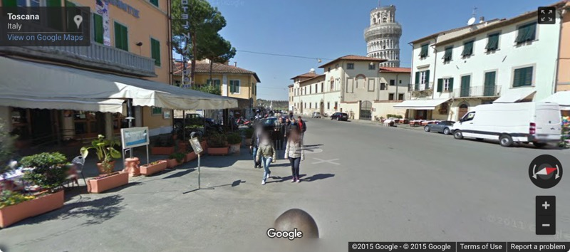](https://www.google.com/maps/@43.7222461,10.3980709,3a,75y,283.86h,85.5t/data=!3m6!1e1!3m4!1s-cEOTnId34DBxCCQgeIbGQ!2e0!7i13312!8i6656)
[Click to see the streetview](https://www.google.com/maps/@43.7222461,10.3980709,3a,75y,283.86h,85.5t/data=!3m6!1e1!3m4!1s-cEOTnId34DBxCCQgeIbGQ!2e0!7i13312!8i6656)

#### Loading the CubeMaps

Here is how load the CubeMap in PEX:
```javascript
Window.create({
    settings: {
        width: 1024,
        height: 576,
        fullscreen: isBrowser
    },
    resources: {
        //first we load 6 images, one per face
        envMap_px: { image: ASSETS_DIR + '/envmaps/pisa_posx.jpg' },
        envMap_nx: { image: ASSETS_DIR + '/envmaps/pisa_negx.jpg' },
        envMap_py: { image: ASSETS_DIR + '/envmaps/pisa_posy.jpg' },
        envMap_ny: { image: ASSETS_DIR + '/envmaps/pisa_negy.jpg' },
        envMap_pz: { image: ASSETS_DIR + '/envmaps/pisa_posz.jpg' },
        envMap_nz: { image: ASSETS_DIR + '/envmaps/pisa_negz.jpg' },
    },
    init: function() {
        //then we create cubemap texture
        this.envMap = ctx.createTextureCube([
            { face: 0, data: res.envMap_px },
            { face: 1, data: res.envMap_nx },
            { face: 2, data: res.envMap_py },
            { face: 3, data: res.envMap_ny },
            { face: 4, data: res.envMap_pz },
            { face: 5, data: res.envMap_nz }
        ])
    }
})
```

#### Reflections

```javascript
//TODO

Why do i need to flip the ray?
```

[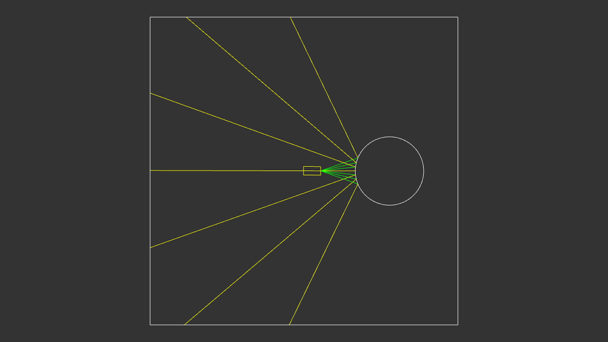](http://marcinignac.com/blog/pragmatic-pbr-hdr/301-reflections/)
[Open live version in a separate window](http://marcinignac.com/blog/pragmatic-pbr-hdr/301-reflections/)


```javascript
//TODO
```

Whole code is available on GitHub in [301-load-cubemap/main.js](https://github.com/vorg/pragmatic-pbr/blob/master/301-load-cubemap/main.js).

You can play with the live version that includes debug mode showing the sides of the cube and third person view showing you the whole scene.

[](http://marcinignac.com/blog/pragmatic-pbr-hdr/301-load-cubemap/)
[Open live version in a separate window](http://marcinignac.com/blog/pragmatic-pbr-hdr/301-load-cubemap/)


## 302-load-equirect

[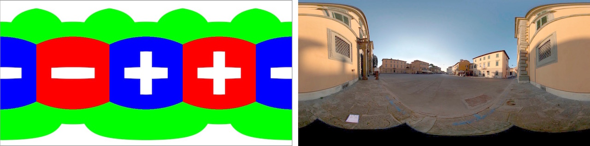](http://marcinignac.com/blog/pragmatic-pbr-hdr/302-load-equirect/)
[Open live version in a separate window](http://marcinignac.com/blog/pragmatic-pbr-hdr/302-load-equirect/)

TODO: this reverse colors
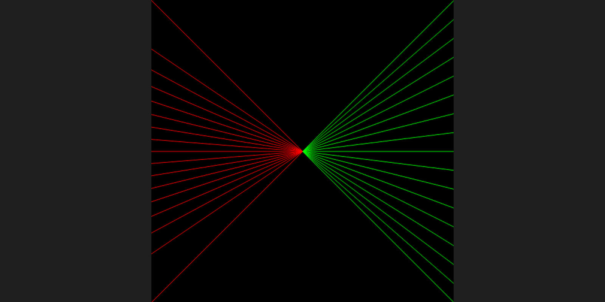

## 303-fullscreenquad-skybox

[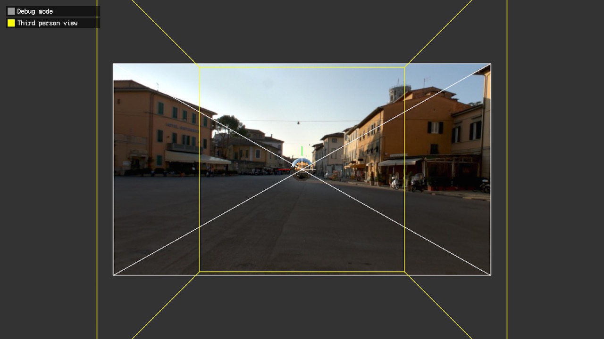](http://marcinignac.com/blog/pragmatic-pbr-hdr/303-fullscreenquad-skybox/)
[Open live version in a separate window](http://marcinignac.com/blog/pragmatic-pbr-hdr/303-fullscreenquad-skybox/)

## 304-load-hdr

[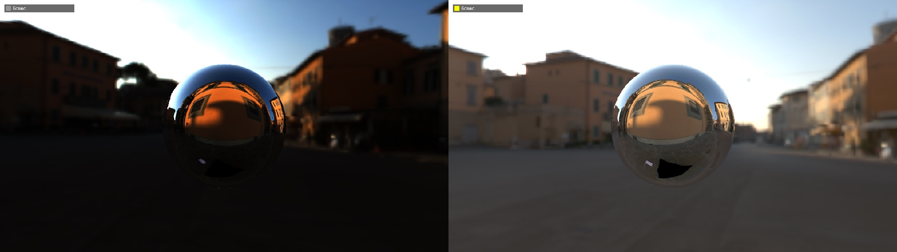](http://marcinignac.com/blog/pragmatic-pbr-hdr/304-load-hdr/)
[Open live version in a separate window](http://marcinignac.com/blog/pragmatic-pbr-hdr/304-load-hdr/)

## 305-exposure-basic

[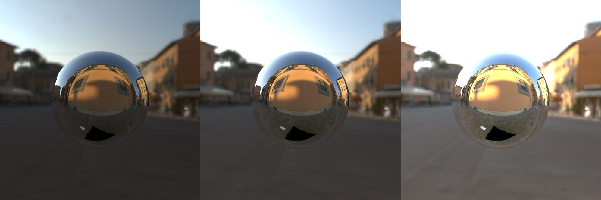](http://marcinignac.com/blog/pragmatic-pbr-hdr/305_exposure_basic/)
[Open live version in a separate window](http://marcinignac.com/blog/pragmatic-pbr-hdr/305_exposure_basic/)

## 306-tonemap-reinhard

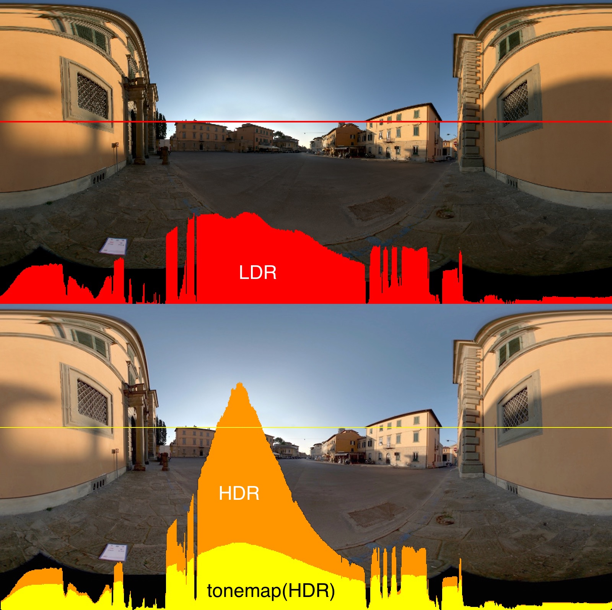

Exposure levels

[](http://marcinignac.com/blog/pragmatic-pbr-hdr/306-tonemap-reinhard/)
[Open live version in a separate window](http://marcinignac.com/blog/pragmatic-pbr-hdr/306-tonemap-reinhard/)

## 307-tonemap-compare

[](http://marcinignac.com/blog/pragmatic-pbr-hdr/307-tonemap-compare/)
[Open live version in a separate window](http://marcinignac.com/blog/pragmatic-pbr-hdr/307-tonemap-compare/)

## 308-exposure-camera

TODO: Link to the camera article

[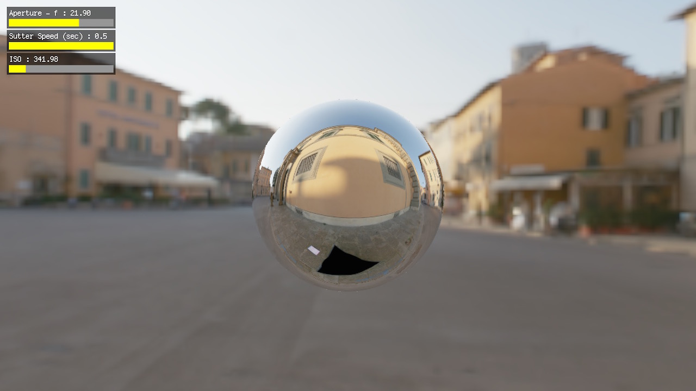](http://marcinignac.com/blog/pragmatic-pbr-hdr/308-exposure-camera/)
[Open live version in a separate window](http://marcinignac.com/blog/pragmatic-pbr-hdr/308-exposure-camera/)

## Resources
