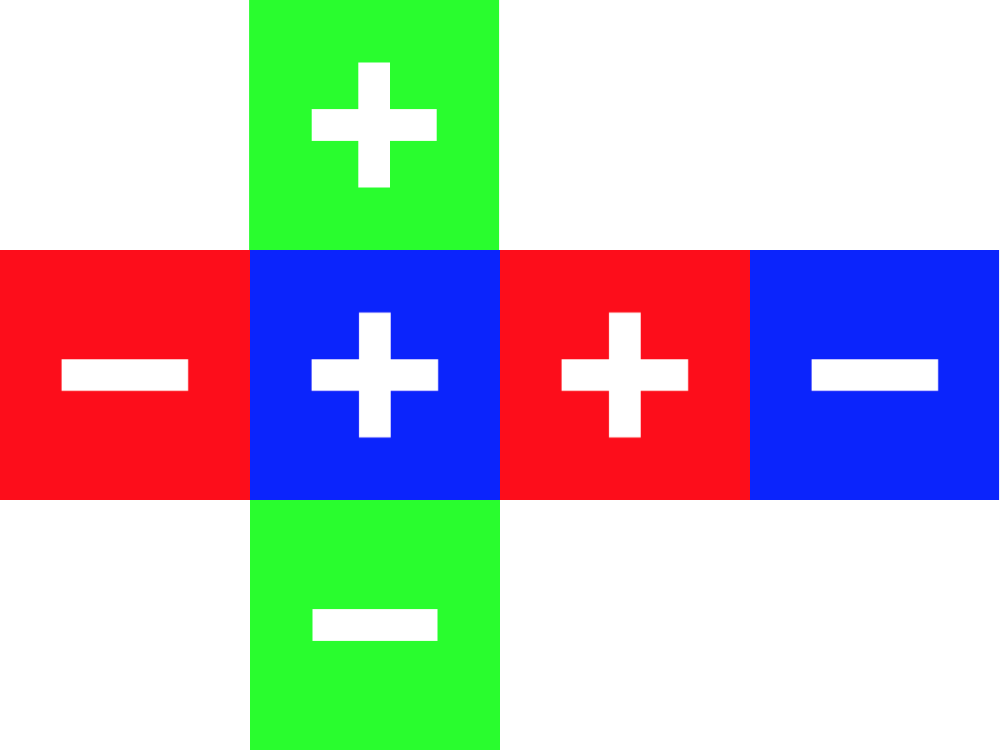
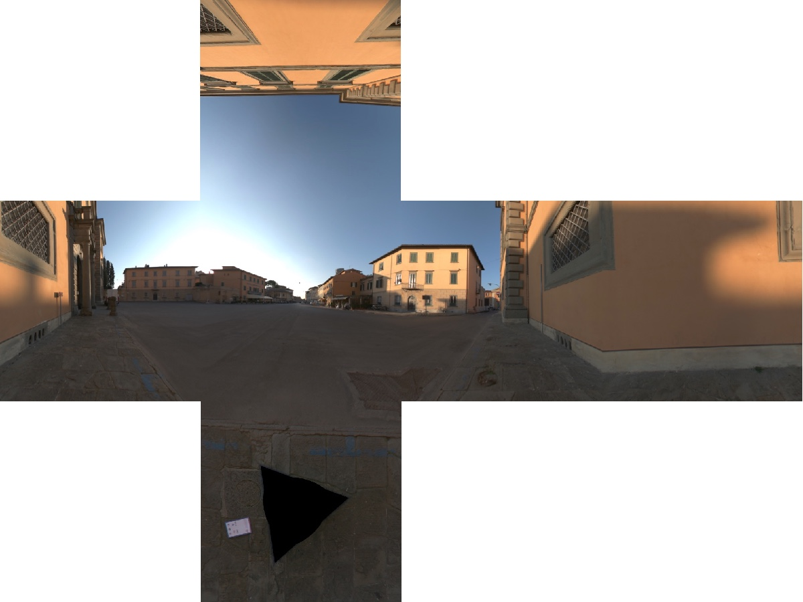
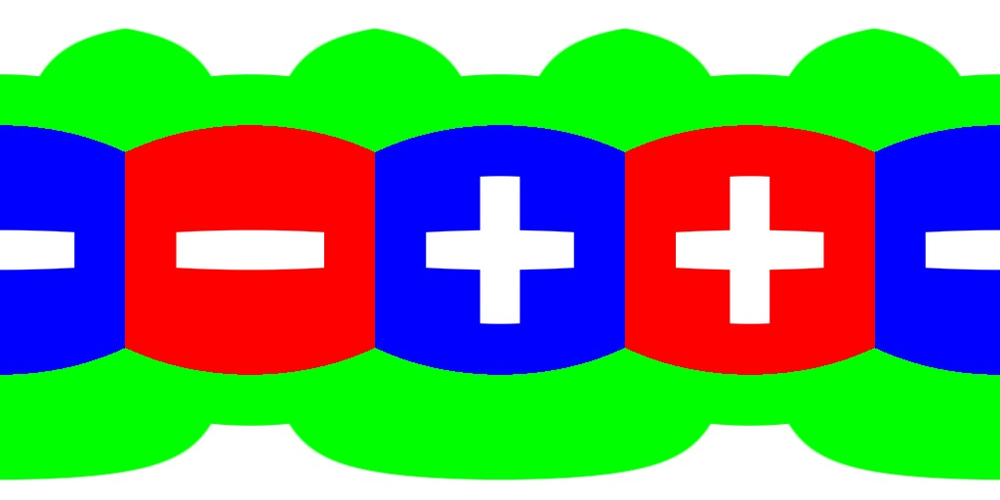
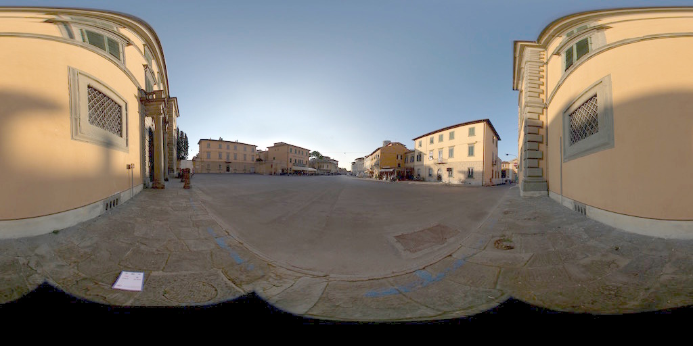

# Pragmatic PBR - HDR

This blog post is a part of series about implementing PBR in WebGL from scratch:

1. [Intro](http://marcinignac.com/blog/pragmatic-pbr-intro)
2. [Setup & Gamma](http://marcinignac.com/blog/pragmatic-pbr-setup-and-gamma)
2. **[HDR](http://marcinignac.com/blog/pragmatic-pbr-hdr)**

## What is HDR?

HDR - High Dynamic Range

## 301-load-cubemap

## 302-load-latlong

## 303-fullscreenquad-skybox

## 304-load-hdr

## 305-exposure-basic

## 306-tonemap-reinhard

## 307-tonemap-compare

## 308-exposure-camera

