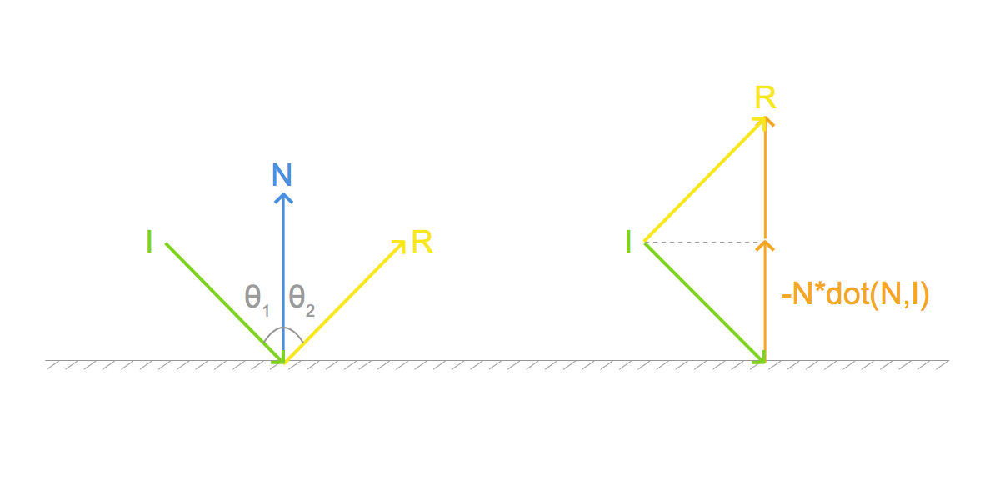
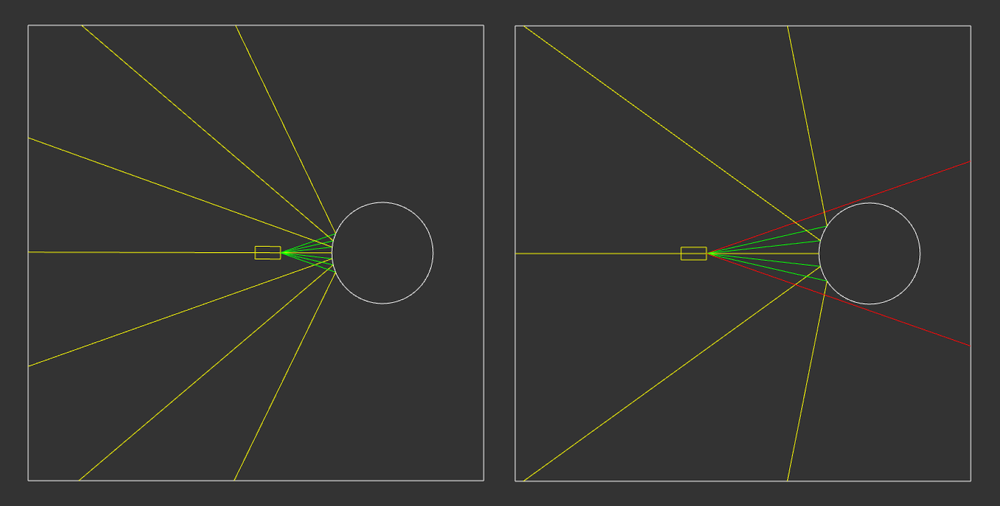
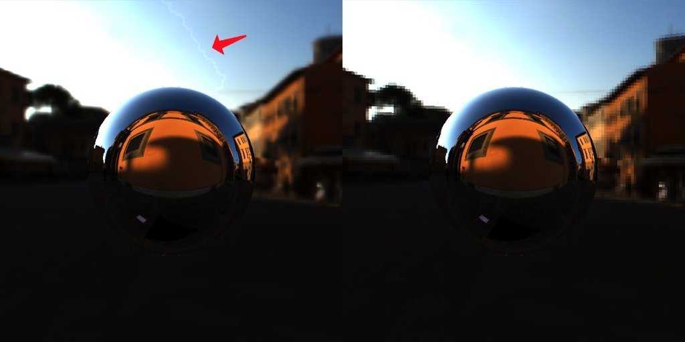
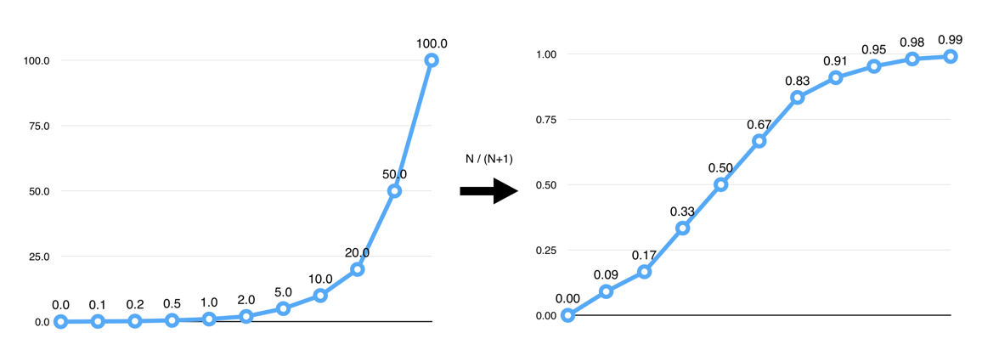

# Pragmatic PBR - HDR

This blog post is a part of series about implementing PBR in WebGL from scratch:

1. [Intro](http://marcinignac.com/blog/pragmatic-pbr-intro)
2. [Setup & Gamma](http://marcinignac.com/blog/pragmatic-pbr-setup-and-gamma)
2. **[HDR](http://marcinignac.com/blog/pragmatic-pbr-hdr)**

## What is HDR?

Traditional images (e.g. your average JPG photo) represent RGB color values as numbers from 0..255 (or 0..1 in GLSL) for each Red, Green and Blue component. This is not how light behaves in real life e.g. sunshine is 1000s times brighter than a lightbulb. In oder to fit the lighting information (pixel brightness / color) into that LDR (Low Dynamic Range) space some of the information has to be lost. That's clearly visible when you take a photo against the sun and suddenly everything else is black or the opposite you focus on your face but the whole background is overexposed and white.


HDR - High Dynamic Range images on the other side allow you to store image data with values above 255. That allows you to capture both the dark and bright areas at the same time. We can then adjust the exposure of the photo in realtime to focus on the desired range or apply process called tonemapping to avoid over or under exposing the image.

## 301-load-cubemap ([code](https://github.com/vorg/pragmatic-pbr/blob/master/301-load-cubemap))

One of the best source of HDR images are so called environment maps. They fully capture the environment around you not only at 360' but also above and below.

We can represent an environment as a cube surrounding the viewer hence the name of such textures in WebGL : *CubeMaps*. Below you can see a cross representation of a CubeMap with 6 sides facing the axes X, Y and Z.


In the GPU memory the faces are represented as a 2D textures in the following order:
<span style="color:red">+X</span>,
<span style="color:red">-X</span>,
<span style="color:green">+Y</span>,
<span style="color:green">-Y</span>,
<span style="color:blue">+Z</span>,
<span style="color:blue">-Z</span>.
Therefore it would be a bit cumbersome to upload such a texture to the GPU in a cross representation so a better way is to load all the faces separately.


#### Cubemap Orientation

There is only one problem. If you look carefully at the animation of the folding cube you will notice that <span style="color:blue">+Z</span> side of the cube is facing away from us. In WebGL the convention is that <span style="color:blue">+Z</span> should face towards the viewer. We call that orientation right handed because if you count on your right hand 1,2,3 for X,Y,Z starting from your thumb you your fingers will form an orthogonal basis with the Z axis pointing towards you.


Cubemaps spec comes from the time when RenderMap ruled the world and [Renderman it's using Left-Handed Coordinate system](https://www.opengl.org/registry/specs/ARB/texture_cube_map.txt) so do the cubemaps. That means to we will need to flip the X axis in our shader whenever we sample from a CubeMap texture. Additionally you will need to point your camera towards <span style="color:blue">+Z</span> instead of the usual <span style="color:blue">-Z</span> in order to start at expected direction. Otherwise you might end up looking at the wall like in case of the Pisa texture we are using.

The Pisa texture comes from [High-Resolution Light Probe Image Gallery
](http://gl.ict.usc.edu/Data/HighResProbes/) but it doesn't specify where exactly it was taken. I've been struggling so much with "should I flip Z or X?" that I decided to find the source and decide once and for all what's left and what's right.

[](https://www.google.com/maps/@43.7222461,10.3980709,3a,75y,283.86h,85.5t/data=!3m6!1e1!3m4!1s-cEOTnId34DBxCCQgeIbGQ!2e0!7i13312!8i6656)
[Click to see the streetview](https://www.google.com/maps/@43.7222461,10.3980709,3a,75y,283.86h,85.5t/data=!3m6!1e1!3m4!1s-cEOTnId34DBxCCQgeIbGQ!2e0!7i13312!8i6656)

#### Loading the CubeMaps

Here is how load the CubeMap in PEX:
```javascript
Window.create({
    settings: {
        width: 1024,
        height: 576,
        fullscreen: isBrowser
    },
    resources: {
        //first we load 6 images, one per face
        envMap_px: { image: ASSETS_DIR + '/envmaps/pisa_posx.jpg' },
        envMap_nx: { image: ASSETS_DIR + '/envmaps/pisa_negx.jpg' },
        envMap_py: { image: ASSETS_DIR + '/envmaps/pisa_posy.jpg' },
        envMap_ny: { image: ASSETS_DIR + '/envmaps/pisa_negy.jpg' },
        envMap_pz: { image: ASSETS_DIR + '/envmaps/pisa_posz.jpg' },
        envMap_nz: { image: ASSETS_DIR + '/envmaps/pisa_negz.jpg' },
    },
    init: function() {
        //then we create cubemap texture
        //we specify face index to match the +X, -X, +Y, -Y, +Z, -Z order
        this.envMap = ctx.createTextureCube([
            { face: 0, data: res.envMap_px },
            { face: 1, data: res.envMap_nx },
            { face: 2, data: res.envMap_py },
            { face: 3, data: res.envMap_ny },
            { face: 4, data: res.envMap_pz },
            { face: 5, data: res.envMap_nz }
        ])
    }
})
```

#### Reflections

Today we will focus only on specular (sharp) reflections on mirror like surfaces (e.g. polished chrome ball). From the [law of reflection](https://en.wikipedia.org/wiki/Reflection_(physics) we know that for such surfaces the reflected ray `R` will bounce of the surface at the same angle as the incoming ray `I` relatively to the surface normal `N` so `θ₁ == θ₂`



In GLSL we can use built-in function `reflect` that is implemented as follows:

```glsl
vec3 reflect(vec3 I, vec3 N) {
    return I - 2.0 * dot(N, I) * N;
}
```

Note: Why substraction? Both ``-N*dot(N, I)`` and `N` seem to point in the same direction... Yes but but `dot(N, I)` is negative here e.g for the vectors above:

```javascript
I = [0.7, -0.7, 0.0]
N = [0.0,  1.0, 0.0]
dot(N, I) = -0.7
```

Not that we know how to reflect vectors we can see that there are two possible scenarios. Either the view ray from the camera will hit the object and bounce back or will continue until hitting the skybox surrounding the scene.

[](http://marcinignac.com/blog/pragmatic-pbr-hdr/301-reflections/)
[Open live version in a separate window](http://marcinignac.com/blog/pragmatic-pbr-hdr/301-reflections/)

Therefore we will need two shaders. One for the Skybox and one for the Sphere (or any other reflective surface).

It's important to remember in which coordinate space we calculate our reflection. Normals are usually in the view (eye) space and it's easy to calculate view ray (eyeDir) in view space as the camera position is `[0,0,0]` so we just negate the vertex position. But the cubemap textures are addressed by a vector in the world space so we need to move our computation there.

Full source for the reflection shader.

*301-load-cubemap/Reflection.frag:*
```glsl
//envMapCube returns a ray flipped along X axis axis
#pragma glslify: envMapCube  = require(../local_modules/glsl-envmap-cube)

uniform mat4 uInverseViewMatrix;
uniform samplerCube uEnvMap;

varying vec3 ecPosition;
varying vec3 ecNormal;

void main() {
    //direction towards they eye (camera) in the view (eye) space
    vec3 ecEyeDir = normalize(-ecPosition);
    //direction towards the camera in the world space
    vec3 wcEyeDir = vec3(uInverseViewMatrix * vec4(ecEyeDir, 0.0));
    //surface normal in the world space
    vec3 wcNormal = vec3(uInverseViewMatrix * vec4(ecNormal, 0.0));

    //reflection vector in the world space. We negate wcEyeDir as the reflect function expect incident vector pointing towards the surface
    vec3 reflectionWorld = reflect(-wcEyeDir, normalize(wcNormal));

    gl_FragColor = textureCube(uEnvMap, envMapCube(reflectionWorld));
}
```

For the skybox the shader is much simpler.

*301-load-cubemap/Skybox.vert:*
```glsl
//Matrix uniforms go here
//...

varying vec3 wcNormal;

void main() {
  //we will use skybox position as it's normal
  wcNormal = aPosition.xyz;
  gl_Position = uProjectionMatrix * uViewMatrix * uModelMatrix * aPosition;
}
```

*301-load-cubemap/Skybox.frag:*
```glsl
//envMapCube returns a ray flipped along X axis
#pragma glslify: envMapCube  = require(../local_modules/glsl-envmap-cube)

varying vec3 wcNormal;

uniform samplerCube uEnvMap;

void main() {
    gl_FragColor = textureCube(uEnvMap, envMapCube(normalize(wcNormal)));
}
```

You can play with the live version that includes debug mode showing the sides of the cube and third person view showing you the whole scene.

[](http://marcinignac.com/blog/pragmatic-pbr-hdr/301-load-cubemap/)
[Open live version in a separate window](http://marcinignac.com/blog/pragmatic-pbr-hdr/301-load-cubemap/)

## 302-load-equirect ([code](https://github.com/vorg/pragmatic-pbr/blob/master/302-load-equirect))

Another popular format for the environment maps are spherical environment maps or equirectangular panoramas.

[](http://marcinignac.com/blog/pragmatic-pbr-hdr/302-load-equirect/)
[Open live version in a separate window](http://marcinignac.com/blog/pragmatic-pbr-hdr/302-load-equirect/)

The obvious upside of this format is that we now have only one image to load. The downside is that both the up and the down face are very distorted but they usually contain the sky and the floor so it's not a big issue in practice.

A great resource for getting free HDR env maps in this format is [Smart IBL Archive](http://www.hdrlabs.com/sibl/archive.html) or the previously mentioned [High-Resolution Light Probe Image Gallery
](http://gl.ict.usc.edu/Data/HighResProbes/).

The only GLSL code that changes is the vector we use to sample texture. That's handled. The conversion from world space ray to the 2d texture coordinate is handled by `glsl-envmap-equirect`.

*302-load-equrect/Skybox.frag:*

```glsl
#ifdef GL_ES
precision highp float;
#endif

//returns 2d texture coordinate for panorama based on world space ray
#pragma glslify: envMapEquirect  = require(../local_modules/glsl-envmap-equirect)

...

void main() {
    ...
    //word space 3d -> texture space 2d
    gl_FragColor = texture2D(uEnvMap, envMapEquirect(reflectionWorld));
}
```

The env map code is based on the GPU Gems article about [Ambient Occlusion](http://http.developer.nvidia.com/GPUGems/gpugems_ch17.html and) and the [High-Resolution Light Probe Image Gallery](http://gl.ict.usc.edu/Data/HighResProbes/).

*glsl-envmap-equirect.glsl:*

```glsl
vec2 envMapEquirect(vec3 wcNormal, float flipEnvMap) {
  //I assume envMap texture has been flipped the WebGL way (pixel 0,0 is a the bottom)
  //therefore we flip wcNorma.y as acos(1) = 0
  float phi = acos(-wcNormal.y);
  float theta = atan(flipEnvMap * wcNormal.x, wcNormal.z) + PI;
  return vec2(theta / TwoPI, phi / PI);
}

vec2 envMapEquirect(vec3 wcNormal) {
    //-1.0 for left handed coordinate system oriented texture (usual case)
    return envMapEquirect(wcNormal, -1.0);
}
```

## 303-fullscreenquad-skybox ([code](https://github.com/vorg/pragmatic-pbr/blob/master/303-fullscreenquad-skybox))

Even though we use a 2D texture we are still rendering a whole cube around the camera. That's a waste of both vertex and pixel shader power. Wouldn't it be better if we render only as much as we see on the screen and not a single pixel more? In a
GameDev StackExchange thread on [Implementing a skybox with GLSL version 330](http://gamedev.stackexchange.com/questions/60313/implementing-a-skybox-with-glsl-version-330) we can find a solution to that problem. By rendering a fullscreen quad and then un-projecting the vertices back into the world space we can calculate a correct sampling vector for our environment map.

[](http://marcinignac.com/blog/pragmatic-pbr-hdr/303-fullscreenquad-skybox/)
[Open live version in a separate window](http://marcinignac.com/blog/pragmatic-pbr-hdr/303-fullscreenquad-skybox/)

*303-fullscreenquad-skybox/main.js:*

```javascript
var skyboxPositions = [[-1,-1],[1,-1], [1,1],[-1,1]];
var skyboxFaces = [ [0, 1, 2], [0, 2, 3]];
var skyboxAttributes = [
    { data: skyboxPositions, location: ctx.ATTRIB_POSITION },
];
var skyboxIndices = { data: skyboxFaces };
this.skyboxMesh = ctx.createMesh(skyboxAttributes, skyboxIndices);
```

*303-fullscreenquad-skybox/SkyboxQuad.vert:*

```glsl
attribute vec4 aPosition;

#pragma glslify: inverse = require('glsl-inverse')
#pragma glslify: transpose = require('glsl-transpose')

uniform mat4 uProjectionMatrix;
uniform mat4 uViewMatrix;

varying vec3 wcNormal;

void main() {
    mat4 inverseProjection = inverse(uProjectionMatrix);
    mat3 inverseModelview = transpose(mat3(uViewMatrix));

    //transform from the normalized device coordinates back to the view space
    vec3 unprojected = (inverseProjection * aPosition).xyz;

    //transfrom from the view space back to the world space
    //and use it as a sampling vector
    wcNormal = inverseModelview * unprojected;

    gl_Position = aPosition;
}
```

## 304-load-hdr ([code](https://github.com/vorg/pragmatic-pbr/blob/master/304-load-hdr))

Finally! We are ready to load a High-Dynamic Range image. High dynamic range images require a different image format than LDR ones due to the bigger precision and more bits per pixel. One of the most popular is [RGBE](https://en.wikipedia.org/wiki/RGBE_image_format) first introduced in [Radiance](https://en.wikipedia.org/wiki/Radiance_%28software%29#HDR_image_format) software and sometimes called HDR Radiance. RGBE files usually have *.hdr* or *.rgbe* file extension.

Storing full double precision floats would require a lot of space so instead in RGBE we store R,G,B channels and a shared exponent taken from the brightest value out of them. Additionally Run Length Encoding is preformed to shrink the size even more.

Source code of these series includes my port `parse-hdr` of a [Java parser]( https://code.google.com/r/cys12345-research/source/browse/hdr/image_processor/RGBE.java?r=7d84e9fd866b24079dbe61fa0a966ce8365f5726) by Kenneth Russell.

There are two approaches to load RGBE file:

a) Load RGBE values into normal 8bit per channel texture and decode the values in a shader.

*glsl-rgbe2rgb:*

```glsl
vec3 rgbe2rgb(vec4 rgbe) {
  return (rgbe.rgb * pow(2.0, rgbe.a * 255.0 - 128.0));
}
```

The downside of this approach is with gl.LINEAR interpolation we will get artifacts as we interpolate between encoded values (left image below). If we switch to gl.NEAREST we get either blocky pixels (right image below) or have to perform the sampling ourself by reading the texture 4 times, decoding the HDR colors and applying interpolation ourselves.



b) Decode the RGBE pixel values into floating point RGB values after loading the image and upload them to a texture with gl.FLOAT data type. The downside is that now we require  [OES_texture_float](https://www.khronos.org/registry/webgl/extensions/OES_texture_float/) extension support (that will be in the core in WebGL 2.0).

This approach is preferred though and therefore implemented in the `parse-hdr` module.

Let's load the file hdr file.

*304-load-hdr/index.js:*

```javascript

var parseHdr     = require('../local_modules/parse-hdr');

Window.create({
    //...
    resources: {
        envMap: { binary: ASSETS_DIR + '/envmaps/pisa_latlong_256.hdr' }
    },
    init: function() {
        var hdrInfo = parseHdr(res.envMap);
        this.envMap = ctx.createTexture2D(
            hdrInfo.data,
            hdrInfo.shape[0],
            hdrInfo.shape[1],
            //floating point texture
            //requires OES_texture_float extension
            { type: ctx.FLOAT }
        );
    }
    //...
})
```

If you run the following example for the first time you will notice everything is very black. RGBE texture pixel values are stored in the linear space so we need to convert them to the gamma space before rendering. You can click the `Gamma` checkbox to enable gamma correction.

[](http://marcinignac.com/blog/pragmatic-pbr-hdr/304-load-hdr/)
[Open live version in a separate window](http://marcinignac.com/blog/pragmatic-pbr-hdr/304-load-hdr/)

## 305-exposure-basic ([code](https://github.com/vorg/pragmatic-pbr/blob/master/305-exposure-basic))

As we said before HDR images have a lot more information in both the lower and the higher range of pixel brightness values. That allows us to change the exposure just like in a real camera.

[](http://marcinignac.com/blog/pragmatic-pbr-hdr/305-exposure-basic/)
[Open live version in a separate window](http://marcinignac.com/blog/pragmatic-pbr-hdr/305-exposure-basic/)

The simplest way to do it is to multiplay the color by a constant, of course as any calculations we do it in the linear space before applying the gamma correction.

*305-exposure-basic/Reflection.frag:*

```glsl
...
gl_FragColor.rgb = texture2D(uEnvMap, envMapEquirect(reflectionWorld)).rgb;

gl_FragColor.rgb *= uExposure;

if (uCorrectGamma) {
    gl_FragColor.rgb = toGamma(gl_FragColor.rgb);
}
...
```

You've probably noticed that for any value of exposure above 0.6 the sky gets overexposed and washed out of any color resulting in full white. That's because the color values go beyond 1 and are getting clamped. We can fix that by applying a process called tonemapping.

## 306-tonemap-reinhard ([code](https://github.com/vorg/pragmatic-pbr/blob/master/306-tonemap-reinhard))

[Tonemapping](https://en.wikipedia.org/wiki/Tone_mapping) is a process of bringing HDR values (0..∞) into the LDR range (0..1) that can be safely (without clamping) displayed on the screen.

One of the simplest tonemapping functions is so called Reinhard (from the Erick Reinhard which introduced it in his paper called ["Photographic Tone Reproduction for Digital Images"](http://www.cmap.polytechnique.fr/~peyre/cours/x2005signal/hdr_photographic.pdf)) where we divide the color value by itself increased by 1 i.e.: `N = N / (N + 1)`. Here goes a graph of a few example values before and after.



Implementation in GLSL:

*glsl-tonemap-reinhard:*

```glsl
vec3 tonemapReinhard(vec3 color) {
  return color / (color + vec3(1.0));
}
```

*306-tonemap-reinhard/Reflection.frag:*

```glsl
gl_FragColor.rgb = texture2D(uEnvMap, envMapEquirect(reflectionWorld)).rgb;

gl_FragColor.rgb *= uExposure;

if (uTonemap) {
    gl_FragColor.rgb = tonemapReinhard(gl_FragColor.rgb);
}

if (uCorrectGamma) {
    gl_FragColor.rgb = toGamma(gl_FragColor.rgb);
}
```

It should be a bit easier to see how the pixels change on the images below. The graphs show values of the pixels from the row highlighted with a straight line. You can notice that tonemapping gets rid of the brightness spikes the areas with the most light but it also flattens the saturation of the image.


And the final working demo so we can see it in action. Notice how the overexposing is gone even for higher values of exposure.

[](http://marcinignac.com/blog/pragmatic-pbr-hdr/306-tonemap-reinhard/)
[Open live version in a separate window](http://marcinignac.com/blog/pragmatic-pbr-hdr/306-tonemap-reinhard/)

## 307-tonemap-compare ([code](https://github.com/vorg/pragmatic-pbr/blob/master/307-tonemap-compare))

In [Filmic Tonemapping Operators](http://filmicgames.com/archives/75) blog post John Hable describes 2 aditional tonemapping functions that try to solve the problem the saturation loss present in Reinhard: Filmic (an optimized version by Jim Hejl and Richard Burgess-Dawson simulating camera's film response) and Uncharted2 (from the name of the game it was first developed for). One thing to note is that Filmic operator doesn't need the Gamma correction to be applied at the end as it has it built-in already. There is even more info about these operators in John's talk on [Uncharted2 Hdr Lighting](http://www.slideshare.net/ozlael/hable-john-uncharted2-hdr-lighting).

[](http://marcinignac.com/blog/pragmatic-pbr-hdr/307-tonemap-compare/)
[Open live version in a separate window](http://marcinignac.com/blog/pragmatic-pbr-hdr/307-tonemap-compare/)

## 308-exposure-camera ([code](https://github.com/vorg/pragmatic-pbr/blob/master/308-exposure-camera))

The exposure controls we were using so far were very primitive - a simple multiplier. It works ok in the most of cases it works ok, but if you are missing real cameral controls like Aperture, Shutter Speed and ISO then [Padraic Hennessy](https://twitter.com/PadraicHennessy) has wrote series of blog posts about [Implementing a Physically Based Camera: Manual Exposure](https://placeholderart.wordpress.com/2014/11/21/implementing-a-physically-based-camera-manual-exposure/). This is more of a bonus than an integral part of what we are trying to build (at least until we get into Depth of Field and Bokeh) so I won't go into the details here just yet. Useful Wikipedia articles that helped me understand what he is writing about: [Middle_gray](https://en.wikipedia.org/wiki/Middle_gray), [Film_speed & Standard_output_sensitivity](https://en.wikipedia.org/wiki/Film_speed#Standard_output_sensitivity_.28SOS.29).

[](http://marcinignac.com/blog/pragmatic-pbr-hdr/308-exposure-camera/)
[Open live version in a separate window](http://marcinignac.com/blog/pragmatic-pbr-hdr/308-exposure-camera/)

## Resources

- [Smart IBL Archive](http://www.hdrlabs.com/sibl/archive.html)
- [High-Resolution Light Probe Image Gallery](http://gl.ict.usc.edu/Data/HighResProbes/).

## Next

In the next post we will focus on Image Based Lighting (IBL) a technique that allows to capture complex lighting information in a HDR texture(s) and I would argue is one of the keys for the Physically Based Rendering realism.

## Comments, feedback and contributing

Please leave any comments below, on twitter [@marcinignac](http://twitter.com/marcinignac) or via positing issues or pull request on Github for this page [pragmatic-pbr/300-hdr.md](https://github.com/vorg/pragmatic-pbr/blob/master/300-hdr.md).
